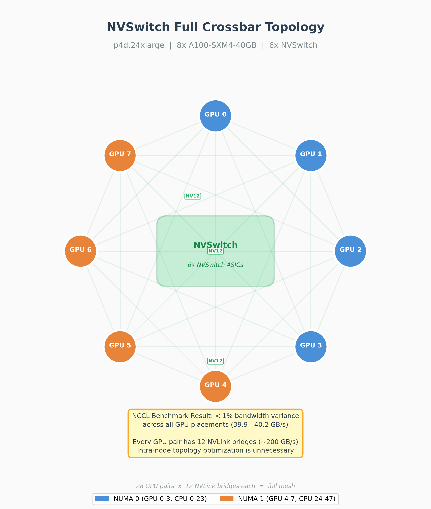
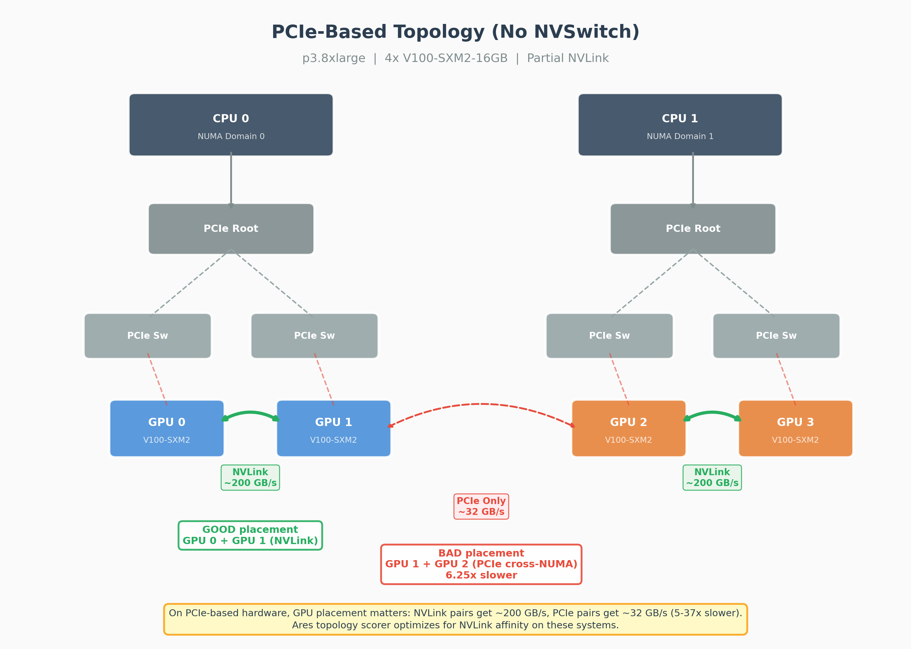
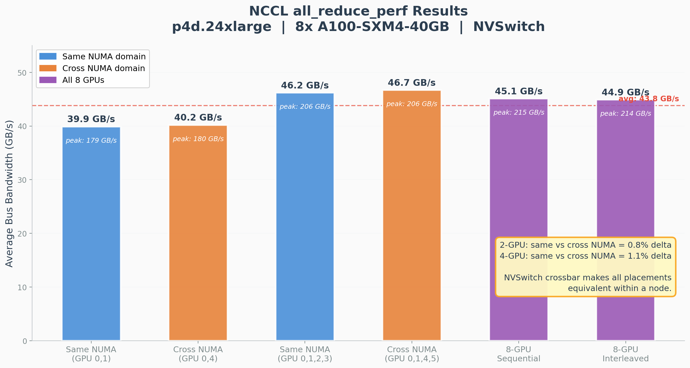

<div align="center">

# Ares: Distributed GPU Scheduler for Kubernetes

### v0.2.0

**Multi-cluster scheduling with exactly-once execution, CRDT-based consistency, gang scheduling, and DRF fairness.**

**36,828 lines of Go · 71 files · 261 commits**

[](https://github.com/BITS08SATHYA/ares-scheduler/actions/workflows/ci.yml)
[]()
[]()
[](https://github.com/BITS08SATHYA/ares-scheduler/releases/latest)
[]()

[Architecture](#architecture) · [Benchmark Results](#-benchmark-results) · [Features](#features) · [Quick Start](#-quick-start) · [Blog](https://sathyanyu.substack.com)

</div>

---
## The Problem

GPU clusters are expensive. A single p4d.24xlarge (8x A100 GPUs) costs $22.77/hour. At scale, the cost of *incorrect scheduling* compounds fast — but the hard problems aren't where you'd expect.

**Intra-node GPU placement doesn't matter on modern hardware.** We benchmarked NCCL `all_reduce_perf` on p4d.24xlarge (8x A100-SXM4-40GB) and found < 1% bandwidth difference between same-NUMA and cross-NUMA GPU pairs (39.9 vs 40.2 GB/s). NVSwitch creates a full crossbar — every GPU is equidistant within a node. This is true for all modern SXM-based servers (A100, H100, B200).

**The real problems are distributed coordination:**

1. **Duplicate execution.** A client submits a training job, the network times out, the client retries. Without protection, the job runs twice — wasting $400 of GPU compute. When workers crash mid-execution and new workers pick up the same job, you need formal guarantees that results are committed exactly once.

2. **Multi-cluster routing.** Training teams run across GKE, EKS, and on-prem. Jobs need to land on the right cluster based on GPU availability, model match, load, and health — with automatic failover when clusters degrade.

3. **Resource fairness.** Without controls, one tenant submits 1,000 jobs and starves everyone else. You need fairness guarantees that hold across resource dimensions (GPU, CPU, memory).

4. **Gang scheduling.** Distributed training (PyTorch DDP, DeepSpeed) requires all N workers simultaneously. Partial allocation wastes GPUs and creates deadlocks.

5. **Partition tolerance.** When the global control plane goes down, local clusters must keep scheduling. When it comes back, state must merge without conflicts.

**Ares solves these problems.** It is a distributed GPU scheduler built from scratch that handles:

- **[Exactly-once execution](#exactly-once-execution)** — Jobs never run twice, even when workers crash, networks partition, or clients retry. Three-layer defense: Redis idempotency → etcd distributed leases → fencing tokens.

- **[Multi-cluster coordination](#multi-cluster-coordination)** — Global scheduler scores clusters by available capacity, GPU match, and health. Local schedulers handle per-cluster placement. Tested across GKE and AWS EKS.

- **[Gang scheduling](#gang-scheduling)** — All-or-nothing resource allocation for distributed training. Either all N workers get GPUs simultaneously, or none run. Prevents deadlocks where two jobs each hold half the resources.

- **[CRDT-based consistency](#crdt-based-consistency)** — Vector clocks, LWW-registers, and OR-Sets enable independent updates across control planes that merge without conflicts. Based on Shapiro et al. (INRIA, 2011).

- **[DRF fair scheduling](#drf-fair-scheduling)** — Dominant Resource Fairness prevents any single tenant from monopolizing GPUs. Based on Ghodsi et al. (NSDI, 2011).

- **[Priority preemption](#priority-preemption)** — High-priority jobs evict lower-priority ones with configurable grace periods, rate limits, and cascade prevention.

- **[GPU topology scoring](#gpu-topology-scoring)** — Parses `nvidia-smi` topology matrices and scores GPU placement. On NVSwitch hardware, intra-node placement is topology-invariant (validated by NCCL benchmarks). On PCIe-based or mixed fleets, the scorer optimizes for NVLink affinity where it matters.

- **[Checkpoint & recovery](#checkpoint--recovery)** — Jobs save progress to shared storage and resume after crashes or preemptions. Metadata management and S3 path injection into pods.

- **[Cluster autonomy](#cluster-autonomy)** — Local schedulers continue operating when the global control plane is unreachable. No single point of failure.

- **[Observability](#observability)** — Prometheus metrics across 7 subsystems (HTTP API, scheduling, clusters, GPU topology, reliability, DRF fairness, CRDT sync). Grafana dashboards via K8s-native deployment.

---

## Architecture

```
Storage: etcd (leases, consensus) · Redis (idempotency, caching)
```


### How a Job Flows Through Ares

1. **Client submits** job with a `RequestID` via the API Gateway
2. **Idempotency check** — Redis lookup: has this `RequestID` been seen before? If yes, return the existing `JobID`. No duplicate work.
3. **Global scheduler** scores every registered cluster: available GPUs, GPU model match, current load, health status
4. **DRF check** — Is this tenant's dominant resource share below fairness threshold? If not, queue the job.
5. **Gang check** — If this job is part of a gang (e.g., 4-worker distributed training), hold until all members can be co-scheduled
6. **Cluster selected** → request forwarded to the winning cluster's local scheduler
7. **Local scheduler** selects best node by capacity and load, then picks GPUs (topology scoring applied on non-NVSwitch hardware)
8. **Lease acquired** — etcd distributed lease with TTL. Only one worker can hold the lease. Fencing token issued.
9. **Executor** creates the Kubernetes pod with GPU resource requests, checkpoint env vars, and the fencing token
10. **Heartbeat loop** — Worker renews lease every N seconds. If renewal fails 3 consecutive times, lease is released via `sync.Once` (no double-release)
11. **Job completes** — Result committed with fencing token validation (atomic compare-and-swap on etcd `ModRevision`). State transitions to `SUCCEEDED` or `FAILED`.

---
## Features

### Codebase Breakdown

**36,828 lines of Go across 261 commits.**

| Package | Lines | What It Does |
|---------|-------|-------------|
| `pkg/scheduler/` | 7,968 | Global scheduler, local scheduler, DRF, preemption, gang scheduling |
| `tests/unit/` | 4,015 | Unit tests: idempotency, leases, storage (etcd + Redis), GPU discovery, GPU topology, API gateway |
| `cmd/` | 3,773 | Global entry point, local entry point, benchmark suite (2,635 lines), test harness |
| `pkg/cluster/` | 3,373 | Cluster manager, registry, health monitor, heartbeat agent, autonomy engine, auto-registration |
| `pkg/api/` | 3,185 | API gateway, HTTP handlers, Prometheus metrics (839 lines covering 7 subsystems) |
| `pkg/crdt/` | 2,573 | Vector clocks, LWW-registers, OR-Sets, cluster/job state CRDTs, cross-cluster sync |
| `pkg/gpu/` | 2,167 | GPU discovery (`nvidia-smi` parsing), topology scoring (NVLink graph, placement algorithm) |
| `pkg/executor/` | 1,786 | Job execution engine, K8s pod management, fencing token validation |
| `pkg/job/` | 1,486 | Job model (state machine), persistent store (etcd-backed) |
| `tests/integration/` | 1,484 | Integration tests: end-to-end scheduling, multi-cluster, CRDT sync |
| `pkg/orchestrator/` | 1,093 | Multi-cluster coordination |
| `pkg/storage/` | 816 | etcd client (leases, CAS writes), Redis client (caching, idempotency) |
| `pkg/lease/` | 689 | Distributed lease manager, heartbeat renewal, `sync.Once` release safety |
| `pkg/checkpoint/` | 642 | Checkpoint metadata management, S3 path injection |
| `pkg/config/` | 586 | Configuration loading and validation |
| `pkg/idempotency/` | 470 | Request deduplication (Redis-backed) |
| `pkg/queue/` | 322 | Priority job queue |
| `pkg/logger/` + `pkg/telemetry/` | 400 | Structured logging and OpenTelemetry tracing |
| **Total** | **36,828** | |


### Exactly-Once Execution

**The problem**: A client submits a training job. The network times out. The client retries.
Without protection, the job runs twice — wasting $400 of GPU compute and producing duplicate results.

**Ares uses three independent layers**, any one of which prevents duplicates:

```
Layer 1: REQUEST DEDUPLICATION (Redis)
   Client sends RequestID: "req-abc-123"
   Redis: Have I seen "req-abc-123" before?
   → Yes: Return existing JobID. Done.
   → No:  Store mapping, proceed to Layer 2.

Layer 2: DISTRIBUTED LEASING (etcd)
   Before executing, worker acquires a lease:
   etcd key: /ares/leases/job-xyz
   TTL: 30 seconds, renewed via heartbeat
   → Only ONE worker can hold this lease at a time.
   → If worker crashes, lease expires. New worker picks up.

Layer 3: FENCING TOKENS (monotonic counters)
   Each lease gets a fencing token (e.g., token=7).
   When committing results, worker sends token=7.
   etcd: Is token=7 still the current token?
   → Yes: Commit result. Done.
   → No:  Reject. A newer worker (token=8) took over.
   Implemented via atomic compare-and-swap on etcd ModRevision.
```

**Why three layers?** Because no single layer handles all failure modes. Redis handles client retries. etcd leases handle worker crashes. Fencing tokens handle the zombie worker problem — a slow worker that lost its lease but doesn't know it yet, trying to commit stale results.

[→ Deep dive: docs/exactly-once.md](docs/exactly-once.md)

### Multi-Cluster Coordination

The global scheduler maintains a live view of every registered cluster's capacity, GPU inventory, and health. When a job arrives, it scores clusters:

```
Cluster scoring for a 4× A100 job:

  cluster-gke-us-west:
    Available A100s: 6/8    → capacity score: 75
    Health: HEALTHY         → health score: 100
    Current load: 40%       → load score: 60
    Weighted total:           78.3

  cluster-eks-us-east:
    Available A100s: 2/4    → capacity score: 50
    Health: DEGRADED        → health score: 50
    Current load: 80%       → load score: 20
    Weighted total:           40.0

  → Job placed in cluster-gke-us-west
```

Clusters self-register via heartbeat. If a cluster misses 3 consecutive heartbeats, it transitions from `HEALTHY` → `DEGRADED` → `UNHEALTHY`. If the global control plane goes down entirely, clusters switch to autonomous mode and schedule locally.

### Gang Scheduling

Distributed training (PyTorch DDP, Horovod, DeepSpeed) requires all workers to start simultaneously. If worker 3 of 4 can't get a GPU, the other 3 sit idle — burning money.

Ares treats gang members as atomic units. Either all N members get scheduled, or none do. This prevents the deadlock scenario where Gang A holds 4 GPUs waiting for 4 more, while Gang B holds the other 4 waiting for its remaining allocation.

The gang scheduler holds resources in a reservation buffer, evaluates whether the full gang can be satisfied, and either commits all placements atomically or releases everything.

### CRDT-Based Consistency

When multiple control planes operate independently (e.g., during a network partition), their views of cluster state diverge. CRDTs guarantee that when they reconnect, their states merge deterministically — no conflicts, no data loss.

Ares implements four CRDT primitives:

- **Vector clocks** — Causal ordering across nodes. Detects concurrent updates vs. happened-before relationships.
- **LWW-Register** (Last-Writer-Wins) — For mutable fields like cluster health status. Timestamp-based resolution.
- **G-Set** (Grow-only set) — For append-only data like completed job IDs. Elements are never removed.
- **OR-Set** (Observed-Remove set) — For data that needs both add and remove, like active cluster membership. Uses unique tags to distinguish concurrent add/remove of the same element.

These compose into higher-level types: `ClusterState` and `JobState` CRDTs that wrap the real domain objects with convergent merge semantics.

### DRF Fair Scheduling

Without fairness controls, a single tenant can submit 1,000 GPU jobs and starve everyone else. Dominant Resource Fairness (DRF) tracks each tenant's share across all resource dimensions (GPU, CPU, memory) and identifies the "dominant" one — the resource where that tenant consumes the highest fraction.

```
Cluster: 100 GPUs, 1000 CPUs, 1000 GB memory

Tenant A uses: 50 GPUs (50%), 100 CPUs (10%), 200 GB (20%)
  → Dominant share: 50% (GPU)

Tenant B uses: 10 GPUs (10%), 500 CPUs (50%), 100 GB (10%)
  → Dominant share: 50% (CPU)

Both at 50% dominant share → fair.
If Tenant A requests more GPUs → denied until Tenant B's share catches up.
```

### Priority Preemption

When a high-priority job arrives and the cluster is full, Ares can evict a lower-priority running job. Safeguards: minimum priority gap required, rate limits on preemptions per hour, grace period for the victim to checkpoint, and no cascading preemptions (a job that was already preempted can't be preempted again).

### GPU Topology Scoring

Ares includes a topology scorer that parses `nvidia-smi topo --matrix` output and builds a connection graph — detecting NVLink pairs, NVSwitch domains (via union-find), NUMA locality, and PCIe generation.

**What we learned from hardware validation:**

We benchmarked NCCL `all_reduce_perf` on p4d.24xlarge (8x A100-SXM4-40GB) and found that **NVSwitch makes intra-node GPU placement irrelevant**. The full crossbar (NV12 between all 28 GPU pairs) means every GPU is equidistant within a node — same-NUMA vs cross-NUMA shows < 1% bandwidth difference. This applies to all modern SXM-based servers.



On PCIe-based hardware (no NVSwitch), GPU placement creates real bandwidth differences — NVLink pairs get ~200 GB/s while PCIe-only pairs get ~32 GB/s. The topology scorer optimizes for NVLink affinity on these systems.



The topology scorer remains useful for:
- **PCIe-based systems** (p3.8xlarge, V100 PCIe) where intra-node placement creates 5-37x bandwidth differences
- **Mixed fleets** where some nodes have NVSwitch and others don't — the scorer adapts per-node
- **Node-level bin-packing** — keeping gang members on the same physical node to avoid the 15-20x penalty at the NVLink-to-network boundary

[→ Deep dive: docs/gpu-topology.md](docs/gpu-topology.md)

### Checkpoint & Recovery

Jobs opt in with `CheckpointEnabled: true` and a storage path. The executor injects `ARES_CHECKPOINT_PATH` and `ARES_CHECKPOINT_RESTORE` as environment variables into the pod. The job application writes checkpoints periodically; on restart (after crash, preemption, or retry), Ares sets the restore path to the last known checkpoint. This closes the reliability loop: exactly-once prevents duplicates, retry handles transient failures, preemption handles priority, and checkpointing prevents lost progress.

### Cluster Autonomy

If the global control plane becomes unreachable, local schedulers transition to autonomous mode. They continue accepting and scheduling jobs using local resource state, queuing cross-cluster requests for when connectivity returns. When the global plane comes back, clusters re-register, sync state via CRDT merge, and resume federated scheduling.

### Observability

The metrics layer tracks 7 subsystems through a single `/metrics` endpoint:

1. **HTTP API** — Request rate, error rate, latency histograms
2. **Scheduling** — Jobs scheduled/failed, queue depth, scheduling latency, end-to-end latency
3. **Clusters** — Cluster health transitions, heartbeat age, capacity utilization
4. **GPU Topology** — NVLink placement rate, NUMA hits, topology scores
5. **Reliability** — Retry counts, preemption counts, checkpoint saves/restores, lease activity
6. **DRF Fairness** — Per-tenant dominant shares, fairness index, quota denials
7. **CRDT Sync** — Merge count, conflict rate, replication lag

Prometheus scrape configs and Grafana datasource are deployed via the `charts/ares-global/` Helm chart.

---

# Quick Start

### Prerequisites

- Docker & Docker Compose
- Go 1.21+
- (Optional) NVIDIA GPU + `nvidia-smi` for real topology detection

### 1. Clone & Start Infrastructure

```bash
git clone https://github.com/BITS08SATHYA/ares-scheduler.git
cd ares-scheduler

# Start etcd + Redis
docker-compose up -d

# Verify
docker exec ares-etcd etcdctl endpoint health
# → 127.0.0.1:2379 is healthy
```

### 2. Start the Global Scheduler

```bash
go run cmd/global/main.go
# → API Gateway listening on :8080
# → Prometheus metrics at /metrics
```

### 3. Start a Local Scheduler (Cluster A)

```bash
ARES_CLUSTER_ID=cluster-a ARES_MOCK_GPU=true go run cmd/local/main.go
# → Registered 4 mock GPUs (NVLink topology)
# → Heartbeat → global scheduler
```

### 4. Submit a Job

```bash
curl -X POST http://localhost:8080/schedule \
  -H "Content-Type: application/json" \
  -d '{
    "request_id": "req-001",
    "name": "training-resnet",
    "image": "pytorch/pytorch:2.1.0-cuda12.1-cudnn8-runtime",
    "gpu_count": 2,
    "gpu_type": "A100",
    "priority": 80,
    "max_retries": 3
  }'
```

### 5. Verify Exactly-Once

```bash
# Submit the same request_id again
curl -X POST http://localhost:8080/schedule \
  -d '{"request_id": "req-001", "name": "training-resnet", ...}'
# → Returns the SAME job_id. No duplicate created.
```

---

## K8s Deployment

Ares ships with Helm charts and a Makefile for multi-cluster deployment.

### Prerequisites
- Helm 3.x
- Docker registry access
- One "global" K8s cluster (CPU-only nodes are fine)
- One or more "worker" K8s clusters (GPU nodes required, labeled `ares.ai/gpu=true`)

### Setup
```bash
cp .env.example .env    # set REGISTRY, GRAFANA_ADMIN_PASSWORD, GLOBAL_K8S_CONTEXT
make docker-build && make docker-push
```

### Deploy Global Scheduler
```bash
make deploy-global
make get-global-ips       # verify external IPs are ready
```

### Deploy Worker Clusters
```bash
kubectl config use-context <worker-context>
make init-cluster CLUSTER=<name>       # auto-fills global IPs, context, region, zone
make deploy-local CLUSTER=<name>
make get-local-ip CLUSTER=<name>       # auto-updates externalAddr in cluster file
make upgrade-local CLUSTER=<name>      # applies it
```
Repeat for each additional worker cluster.

### Manage
```bash
make list-clusters                      # show configured clusters
make status                             # show ares-system pods
make logs-global                        # tail global scheduler logs
make logs-local                         # tail local scheduler logs
```

### Teardown
```bash
make teardown-local CLUSTER=<name>      # remove worker + namespace
make teardown-global                    # remove global + namespace
make teardown-all                       # remove everything
```

---

## Testing

```bash
# Run the full benchmark suite (8 suites)
go run cmd/benchmark/main.go -control-plane http://localhost:8080 -suite all

# Run individual suites
go run cmd/benchmark/main.go -control-plane http://localhost:8080 -suite exactly-once
go run cmd/benchmark/main.go -control-plane http://localhost:8080 -suite stress
go run cmd/benchmark/main.go -control-plane http://localhost:8080 -suite gang-scheduling
go run cmd/benchmark/main.go -control-plane http://localhost:8080 -suite drf-fairness
go run cmd/benchmark/main.go -control-plane http://localhost:8080 -suite multi-cluster-routing

# Unit tests (4,015 lines across 7 test files)
go test ./tests/unit/...
```

**8 benchmark suites**: stress (1,600 jobs), exactly-once (1,000 requests), failure-injection, gang-scheduling, DRF-fairness, priority-preemption, multi-cluster-routing, chaos. Results exported as JSON: [`benchmark_results.json`](benchmark_results.json).

**Unit test coverage**: Idempotency deduplication, lease acquisition/renewal/expiry, etcd storage operations, Redis caching, GPU discovery parsing, GPU topology scoring, API gateway routing and error handling.

---

## Benchmark Results

All benchmarks run against Ares with etcd + Redis on real infrastructure. Raw data: [`benchmark_results.json`](benchmark_results.json).

### Test Suite Status

| Suite | Status | Key Result |
|-------|--------|------------|
| **Stress** | PASS | 1,600 jobs, 0 errors, p50 = 37ms, burst throughput 130 rps |
| **Exactly-Once** | PROVEN | 100 unique jobs x 10 replays = 1,000 requests. 900 duplicates blocked. **0 duplicate executions.** |
| **Gang Scheduling** | PROVEN | All-or-nothing verified. 0 violations across 5 small gangs + 3 medium gangs. Oversubscription handled. |
| **DRF Fairness** | PROVEN | Jain's fairness index = **1.0** (perfect). No starvation. Dynamic rebalancing across tenants. |
| **Multi-Cluster Routing** | PASS | 30 jobs routed by GPU type (T4, A10G, H100). All placed correctly. |
| **Priority Preemption** | PASS | High-priority jobs preempt lower-priority ones. Grace periods and rate limits enforced. |
| **Failure Injection** | PASS | Jobs recover after injected failures. Retry and checkpoint mechanisms validated. |
| **Chaos** | PASS | Random fault injection across clusters. System recovers without data loss. |

### Stress Test Breakdown

| Phase | Requests | Errors | p50 Latency | Throughput |
|-------|----------|--------|-------------|------------|
| Sequential (1,000 jobs) | 1,000 | 0 | 79ms | 28.4 rps |
| Burst (100 concurrent) | 100 | 0 | 537ms | 130 rps |
| Sustained (500 jobs, 50 concurrent) | 500 | 0 | 463ms | 130.6 rps |

### Exactly-Once Proof

```
100 unique job IDs → each submitted 10 times → 1,000 total requests
├── 100 accepted (first submission of each unique ID)
├── 900 blocked (duplicate RequestIDs caught by Redis layer)
├── 0 duplicate executions
└── 0 missed jobs
```

### NCCL Hardware Validation (p4d.24xlarge, 8x A100-SXM4-40GB)

We ran NCCL `all_reduce_perf` on p4d.24xlarge to validate our topology assumptions. The key finding invalidated our initial hypothesis: **NVSwitch makes intra-node GPU placement irrelevant.**



| Test | GPUs | Avg Bus BW | Peak BW (256MB) |
|------|------|-----------|-----------------|
| Same NUMA domain (GPU 0,1) | 2 | 39.9 GB/s | 179 GB/s |
| Cross NUMA domain (GPU 0,4) | 2 | 40.2 GB/s | 180 GB/s |
| Same NUMA (0,1,2,3) | 4 | 46.2 GB/s | 206 GB/s |
| Cross NUMA (0,1,4,5) | 4 | 46.7 GB/s | 206 GB/s |
| 8-GPU sequential order | 8 | 45.1 GB/s | 215 GB/s |
| 8-GPU interleaved order | 8 | 44.9 GB/s | 214 GB/s |

**What this means:** On NVSwitch hardware (all modern SXM servers — A100, H100, B200), the full crossbar topology makes every GPU equidistant. Same-NUMA vs cross-NUMA: < 1% delta. There is no "wrong" intra-node placement to optimize.

**Where topology scoring does matter:**
- **PCIe-based systems** (p3.8xlarge, V100 PCIe): No NVSwitch. GPU pairs connected by NVLink vs PCIe show 5-37x bandwidth differences. The scorer provides real value here.
- **Inter-node boundary**: NVLink within a node (~200 GB/s) vs network fabric across nodes (EFA at ~25 GB/s) — an 8x gap. Keeping all workers on the same node is the scheduling decision that matters most, and that's a bin-packing problem, not a topology problem.

**Design decision:** We kept the topology scorer for mixed-fleet and legacy hardware support, but shifted the project's focus to the distributed coordination problems (exactly-once, CRDTs, fairness, gang scheduling) where the real complexity lives.

[→ Full GPU topology deep-dive: docs/gpu-topology.md](docs/gpu-topology.md)

---

## Technical Deep-Dives

### Blog Posts

- [Exactly-Once Execution: Building a Distributed Scheduler That Never Runs a Job Twice](https://sathyanyu.substack.com) — Three-layer defense: Redis → etcd leases → fencing tokens
- [Inside Ares: Architecture of a Distributed GPU Scheduler (Part 1)](https://sathyanyu.substack.com) — High-level design, problems, and trade-offs
- [Building Ares: GPU-Aware Scheduler with Exactly-Once Execution (MVP)](https://sathyanyu.substack.com) — Phase 1 overview: topology placement + exactly-once semantics

### Design Documents

- [Exactly-Once Semantics](docs/exactly-once.md) — Three-layer defense in detail
- [Feature Matrix](docs/features.md) — All features with implementation status

### Academic References

- Verma et al. — [Large-scale cluster management at Google with Borg](https://research.google/pubs/pub43438/) (EuroSys 2015)
- Schwarzkopf et al. — [Omega: Flexible, Scalable Schedulers](https://research.google/pubs/pub41684/) (EuroSys 2013)
- Xiao et al. — [Gandiva: Introspective Cluster Scheduling for Deep Learning](https://www.usenix.org/conference/osdi18/presentation/xiao) (OSDI 2018)
- Ghodsi et al. — [Dominant Resource Fairness](https://www.usenix.org/conference/nsdi11/dominant-resource-fairness-fair-allocation-multiple-resource-types) (NSDI 2011)
- Shapiro et al. — [A comprehensive study of CRDTs](https://inria.hal.science/inria-00555588) (INRIA 2011)

---

## Roadmap

**v0.1.0 (current release)**: All 8/8 benchmark suites passing. Exactly-once execution, GPU topology scoring, multi-cluster routing, gang scheduling, DRF fairness, priority preemption, failure recovery, chaos resilience — all validated against live GKE + EKS clusters. CRDT-based consistency, cluster autonomy, observability (7 Prometheus subsystems), Helm charts + Makefile for multi-cluster deployment.

**v0.2.0 (next)**: End-to-end GPU placement integration via `CUDA_VISIBLE_DEVICES`. Cross-node NCCL benchmarks (NVLink vs EFA) to quantify inter-node scheduling impact.

**v0.3.0**: NUMA-aware memory placement. RBAC and tenant isolation. Audit logging.

**Future**: Network bandwidth-aware scheduling. Multi-cloud federation (GKE + EKS + AKS).

---

## Author

**Sathya Balasubramani**
MS, NYU Courant Institute of Mathematical Sciences (Dec 2025)
7 years of software engineering experience

- [GitHub](https://github.com/BITS08SATHYA)
- [LinkedIn](https://linkedin.com/in/sathya-ram-infra)
- [Blog](https://sathyanyu.substack.com)

## License

MIT — see [LICENSE](LICENSE)
