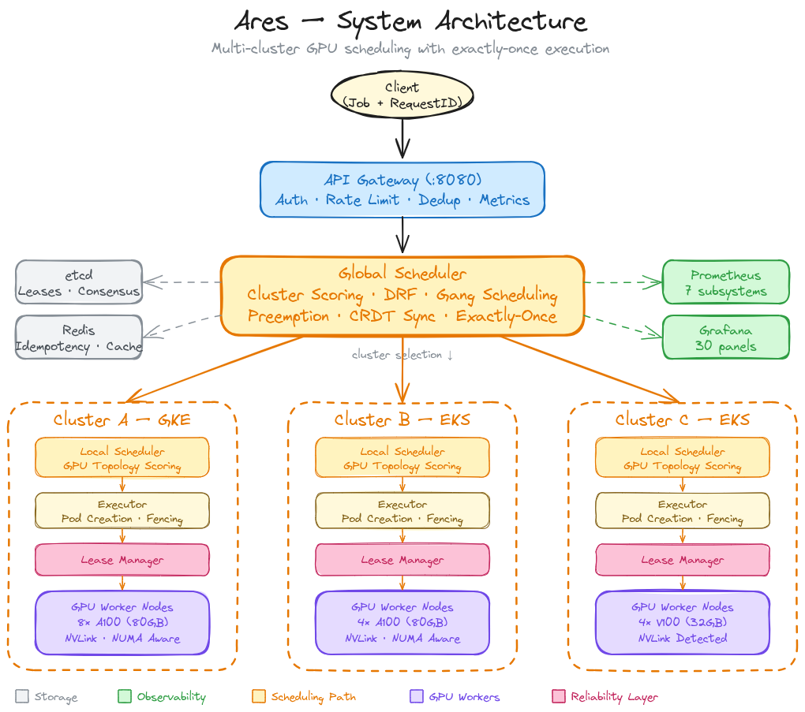
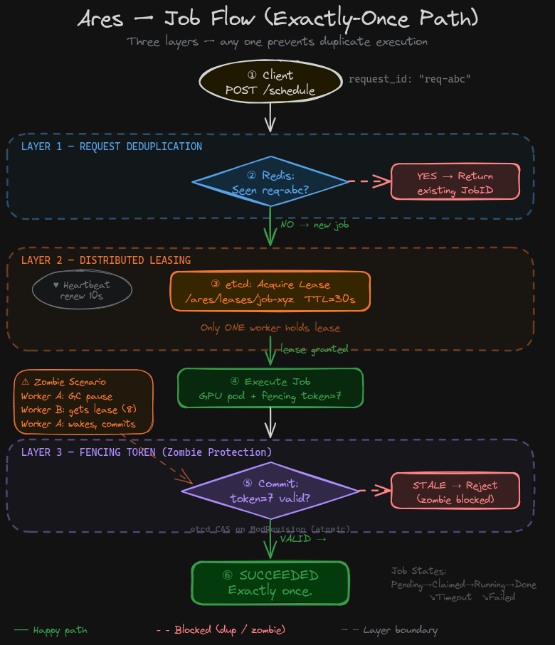

<div align="center">

# Ares: Distributed GPU Scheduler for Kubernetes

### v0.1.0

**Multi-cluster scheduling with exactly-once execution, GPU topology optimization, CRDT-based consistency 
and Gang Scheduling.**

**27,000+ lines of Go · 48 files · 157 commits**

[]()
[]()
[]()

[Architecture](#architecture) · [Benchmark Results](#-benchmark-results) · [Features](#features) · [Quick Start](#-quick-start) · [Blog](https://sathyanyu.substack.com)

</div>

---
## The Problem

GPU clusters are expensive. A single p4d.24xlarge (8× A100 GPUs) costs $22.77/hour.

When your scheduler places two GPUs on opposite sides of a PCIe bus instead of an NVLink bridge, your distributed training job communicates at 16 GB/s instead of 600 GB/s. You just turned a 3-hour job into a 10-hour job and burned $230 for nothing.

It gets worse at scale. When jobs span multiple clusters, you need coordination. When workers crash mid-execution, you need guarantees. When the network partitions, you need the system to keep working.

**Ares solves this.** It is a distributed GPU scheduler built from scratch that handles:

- ✅ **[Exactly-once execution](#exactly-once-execution)** — Jobs never run twice, even when workers crash, networks partition, or clients retry. Three-layer defense: Redis idempotency → etcd distributed leases → fencing tokens.

- ✅ **[GPU topology-aware placement](#gpu-topology-aware-placement)** — Parses `nvidia-smi` topology matrices, builds NVLink connection graphs, and scores every placement candidate. Validated against NCCL benchmarks on 8× A100 NVSwitch (p4d.24xlarge). Optimizes at the inter-node boundary where NVLink→network bandwidth ratios create 4–5× differences.

- ✅ **[Multi-cluster coordination](#multi-cluster-coordination)** — Global scheduler scores clusters by available capacity, GPU match, and health. Local schedulers handle per-cluster placement. Tested across GKE and AWS EKS.

- ✅ **[Gang scheduling](#gang-scheduling)** — All-or-nothing resource allocation for distributed training. Either all N workers get GPUs simultaneously, or none run. Prevents deadlocks where two jobs each hold half the resources.

- ✅ **[CRDT-based consistency](#crdt-based-consistency)** — Vector clocks, LWW-registers, and OR-Sets enable independent updates across control planes that merge without conflicts. Based on Shapiro et al. (INRIA, 2011).

- ✅ **[DRF fair scheduling](#drf-fair-scheduling)** — Dominant Resource Fairness prevents any single tenant from monopolizing GPUs. Based on Ghodsi et al. (NSDI, 2011).

- 🔧 **[Priority preemption](#priority-preemption)** *(in progress)* — High-priority jobs evict lower-priority ones with configurable grace periods, rate limits, and cascade prevention. Core logic implemented; preemption trigger under active development.

- 🔧 **[Checkpoint & recovery](#checkpoint--recovery)** *(in progress)* — Jobs save progress to shared storage and resume after crashes or preemptions. Metadata management and S3 path injection implemented; end-to-end failure recovery under active development.

- ✅ **[Cluster autonomy](#cluster-autonomy)** — Local schedulers continue operating when the global control plane is unreachable. No single point of failure.

- ✅ **[Observability](#observability)** — Prometheus metrics across 7 subsystems (HTTP API, scheduling, clusters, GPU topology, reliability, DRF fairness, CRDT sync). Grafana dashboards via K8s-native deployment.

---

## Architecture

```                 
Storage: etcd (leases, consensus) · Redis (idempotency, caching)
```


### How a Job Flows Through Ares

1. **Client submits** job with a `RequestID` via the API Gateway
2. **Idempotency check** — Redis lookup: has this `RequestID` been seen before? If yes, return the existing `JobID`. No duplicate work.
3. **Global scheduler** scores every registered cluster: available GPUs, GPU model match, current load, health status
4. **DRF check** — Is this tenant's dominant resource share below fairness threshold? If not, queue the job.
5. **Gang check** — If this job is part of a gang (e.g., 4-worker distributed training), hold until all members can be co-scheduled
6. **Cluster selected** → request forwarded to the winning cluster's local scheduler
7. **Local scheduler** runs GPU topology scoring: parse NVLink graph, evaluate all candidate placements, pick the highest-scoring set
8. **Lease acquired** — etcd distributed lease with TTL. Only one worker can hold the lease. Fencing token issued.
9. **Executor** creates the Kubernetes pod with GPU resource requests, checkpoint env vars, and the fencing token
10. **Heartbeat loop** — Worker renews lease every N seconds. If renewal fails 3 consecutive times, lease is released via `sync.Once` (no double-release)
11. **Job completes** — Result committed with fencing token validation (atomic compare-and-swap on etcd `ModRevision`). State transitions to `SUCCEEDED` or `FAILED`.

---
## Features

### Codebase Breakdown

| Package | Lines | What It Does |
|---------|-------|-------------|
| `pkg/scheduler/` | 5,119 | Global scheduler, local scheduler, DRF, preemption, gang scheduling |
| `pkg/api/` | 2,922 | API gateway, HTTP handlers, Prometheus metrics (714 lines covering 7 subsystems) |
| `pkg/cluster/` | 2,782 | Cluster manager, registry, health monitor, heartbeat agent, autonomy engine, auto-registration |
| `pkg/gpu/` | 1,897 | GPU discovery (`nvidia-smi` parsing), topology scoring (NVLink graph, placement algorithm) |
| `pkg/executor/` | 1,801 | Job execution engine, K8s pod management, fencing token validation |
| `pkg/crdt/` | 1,553 | Vector clocks, LWW-registers, OR-Sets, cluster/job state CRDTs, cross-cluster sync |
| `pkg/job/` | 961 | Job model (state machine), persistent store (etcd-backed) |
| `pkg/orchestrator/` | 828 | Multi-cluster coordination |
| `pkg/lease/` | 652 | Distributed lease manager, heartbeat renewal, `sync.Once` release safety |
| `pkg/storage/` | 784 | etcd client (leases, CAS writes), Redis client (caching, idempotency) |
| `pkg/checkpoint/` | 307 | Checkpoint metadata management, S3 path injection |
| `pkg/queue/` | 321 | Priority job queue |
| `pkg/idempotency/` | 297 | Request deduplication (Redis-backed) |
| `cmd/` | 2,701 | Global entry point, local entry point, benchmark suite (1,576 lines), test harness |
| `tests/unit/` | 3,973 | Unit tests: idempotency, leases, storage (etcd + Redis), GPU discovery, GPU topology, API gateway |
| **Total** | **27,334** | |


### Exactly-Once Execution

**The problem**: A client submits a training job. The network times out. The client retries. 
Without protection, the job runs twice — wasting $400 of GPU compute and producing duplicate results.

**Ares uses three independent layers**, any one of which prevents duplicates:

```
Layer 1: REQUEST DEDUPLICATION (Redis)
   Client sends RequestID: "req-abc-123"
   Redis: Have I seen "req-abc-123" before?
   → Yes: Return existing JobID. Done.
   → No:  Store mapping, proceed to Layer 2.

Layer 2: DISTRIBUTED LEASING (etcd)
   Before executing, worker acquires a lease:
   etcd key: /ares/leases/job-xyz
   TTL: 30 seconds, renewed via heartbeat
   → Only ONE worker can hold this lease at a time.
   → If worker crashes, lease expires. New worker picks up.

Layer 3: FENCING TOKENS (monotonic counters)
   Each lease gets a fencing token (e.g., token=7).
   When committing results, worker sends token=7.
   etcd: Is token=7 still the current token?
   → Yes: Commit result. Done.
   → No:  Reject. A newer worker (token=8) took over.
   Implemented via atomic compare-and-swap on etcd ModRevision.
```

**Why three layers?** Because no single layer handles all failure modes. Redis handles client retries. etcd leases handle worker crashes. Fencing tokens handle the zombie worker problem — a slow worker that lost its lease but doesn't know it yet, trying to commit stale results.

[→ Deep dive: docs/exactly-once.md](docs/exactly-once.md)

### GPU Topology-Aware Placement

**The problem**: An 8-GPU server (like p4d.24xlarge) has complex interconnect topologies. GPUs within the same node communicate via NVLink at ~200 GB/s bus bandwidth. GPUs across nodes communicate over network fabric at ~40-50 GB/s. That's a **4–5× bandwidth difference** — placing a distributed training job on the wrong node boundary turns a 3-hour job into a 12-hour job.

**Ares parses the actual GPU topology** from `nvidia-smi topo --matrix` and builds a connection graph:

```
GPU Topology (p4d.24xlarge, 8× A100-SXM4-40GB):
Actual nvidia-smi output from our benchmark hardware:

      GPU0  GPU1  GPU2  GPU3  GPU4  GPU5  GPU6  GPU7
GPU0   X    NV12  NV12  NV12  NV12  NV12  NV12  NV12
GPU1  NV12   X    NV12  NV12  NV12  NV12  NV12  NV12
GPU2  NV12  NV12   X    NV12  NV12  NV12  NV12  NV12
GPU3  NV12  NV12  NV12   X    NV12  NV12  NV12  NV12
GPU4  NV12  NV12  NV12  NV12   X    NV12  NV12  NV12
GPU5  NV12  NV12  NV12  NV12  NV12   X    NV12  NV12
GPU6  NV12  NV12  NV12  NV12  NV12  NV12   X    NV12
GPU7  NV12  NV12  NV12  NV12  NV12  NV12  NV12   X

NUMA node 0: GPU 0-3 (CPU cores 0-23, 48-71)
NUMA node 1: GPU 4-7 (CPU cores 24-47, 72-95)

NV12 = 12 NVLink bridges (~200 GB/s bus bandwidth at large message sizes)
```

**Key insight from benchmarking**: NVSwitch creates a flat all-to-all crossbar within a node same-NUMA vs cross-NUMA 
placement shows < 1% bandwidth difference (39.9 vs 40.2 GB/s). The topology scorer's value is at the
**inter-node boundary**, where NVLink→network transitions create 4–5× bandwidth drops. 
On non-NVSwitch hardware (PCIe-based systems like p3.8xlarge), intra-node placement produces 5–37× differences 
and the scorer's per-GPU optimization becomes critical.

**Scoring algorithm** (example on PCIe-based hardware like p3.8xlarge):
```
For a 2-GPU job requesting V100s:

  Candidate [GPU0, GPU1]: NVLink connection → +50 points     = 50
  Candidate [GPU0, GPU2]: PCIe only         → -30 points     = -30
  
  Winner: GPU0 + GPU1 — uses NVLink.
  Avoided: GPU0 + GPU2 — would force PCIe communication (5-37× slower).
```

On NVSwitch hardware (p4d.24xlarge), all GPU pairs score equally (NV12 everywhere). The scorer detects this and shifts optimization to **inter-node placement** — keeping gang members on the same physical node rather than splitting across network boundaries.

**Benchmark validated**: Topology parsing and scoring tested against real `nvidia-smi` output from p4d.24xlarge (8× A100-SXM4-40GB). NCCL `all_reduce_perf` benchmarks confirmed NVSwitch intra-node topology invariance (< 1% delta) and informed the scorer's focus on inter-node placement boundaries. See [Benchmark Results](#-benchmark-results).

[→ Deep dive: docs/gpu-topology.md](docs/gpu-topology.md)

### Multi-Cluster Coordination

The global scheduler maintains a live view of every registered cluster's capacity, GPU inventory, and health. When a job arrives, it scores clusters:

```
Cluster scoring for a 4× A100 job:

  cluster-gke-us-west:
    Available A100s: 6/8    → capacity score: 75
    Health: HEALTHY         → health score: 100
    Current load: 40%       → load score: 60
    Weighted total:           78.3

  cluster-eks-us-east:
    Available A100s: 2/4    → capacity score: 50
    Health: DEGRADED        → health score: 50
    Current load: 80%       → load score: 20
    Weighted total:           40.0

  → Job placed in cluster-gke-us-west
```

Clusters self-register via heartbeat. If a cluster misses 3 consecutive heartbeats, it transitions from `HEALTHY` → `DEGRADED` → `UNHEALTHY`. If the global control plane goes down entirely, clusters switch to autonomous mode and schedule locally.

### Gang Scheduling

Distributed training (PyTorch DDP, Horovod, DeepSpeed) requires all workers to start simultaneously. If worker 3 of 4 can't get a GPU, the other 3 sit idle — burning money.

Ares treats gang members as atomic units. Either all N members get scheduled, or none do. This prevents the deadlock scenario where Gang A holds 4 GPUs waiting for 4 more, while Gang B holds the other 4 waiting for its remaining allocation.

The gang scheduler holds resources in a reservation buffer, evaluates whether the full gang can be satisfied, and either commits all placements atomically or releases everything.

### CRDT-Based Consistency

When multiple control planes operate independently (e.g., during a network partition), their views of cluster state diverge. CRDTs guarantee that when they reconnect, their states merge deterministically — no conflicts, no data loss.

Ares implements four CRDT primitives:

- **Vector clocks** — Causal ordering across nodes. Detects concurrent updates vs. happened-before relationships.
- **LWW-Register** (Last-Writer-Wins) — For mutable fields like cluster health status. Timestamp-based resolution.
- **G-Set** (Grow-only set) — For append-only data like completed job IDs. Elements are never removed.
- **OR-Set** (Observed-Remove set) — For data that needs both add and remove, like active cluster membership. Uses unique tags to distinguish concurrent add/remove of the same element.

These compose into higher-level types: `ClusterState` and `JobState` CRDTs that wrap the real domain objects with convergent merge semantics.

### DRF Fair Scheduling

Without fairness controls, a single tenant can submit 1,000 GPU jobs and starve everyone else. Dominant Resource Fairness (DRF) tracks each tenant's share across all resource dimensions (GPU, CPU, memory) and identifies the "dominant" one — the resource where that tenant consumes the highest fraction.

```
Cluster: 100 GPUs, 1000 CPUs, 1000 GB memory

Tenant A uses: 50 GPUs (50%), 100 CPUs (10%), 200 GB (20%)
  → Dominant share: 50% (GPU)

Tenant B uses: 10 GPUs (10%), 500 CPUs (50%), 100 GB (10%)
  → Dominant share: 50% (CPU)

Both at 50% dominant share → fair.
If Tenant A requests more GPUs → denied until Tenant B's share catches up.
```

### Priority Preemption

When a high-priority job arrives and the cluster is full, Ares can evict a lower-priority running job. Safeguards: minimum priority gap required, rate limits on preemptions per hour, grace period for the victim to checkpoint, and no cascading preemptions (a job that was already preempted can't be preempted again).

### Checkpoint & Recovery

Jobs opt in with `CheckpointEnabled: true` and a storage path. The executor injects `ARES_CHECKPOINT_PATH` and `ARES_CHECKPOINT_RESTORE` as environment variables into the pod. The job application writes checkpoints periodically; on restart (after crash, preemption, or retry), Ares sets the restore path to the last known checkpoint. This closes the reliability loop: exactly-once prevents duplicates, retry handles transient failures, preemption handles priority, and checkpointing prevents lost progress.

### Cluster Autonomy

If the global control plane becomes unreachable, local schedulers transition to autonomous mode. They continue accepting and scheduling jobs using local resource state, queuing cross-cluster requests for when connectivity returns. When the global plane comes back, clusters re-register, sync state via CRDT merge, and resume federated scheduling.

### Observability

The metrics layer tracks 7 subsystems through a single `/metrics` endpoint:

1. **HTTP API** — Request rate, error rate, latency histograms
2. **Scheduling** — Jobs scheduled/failed, queue depth, scheduling latency, end-to-end latency
3. **Clusters** — Cluster health transitions, heartbeat age, capacity utilization
4. **GPU Topology** — NVLink placement rate, NUMA hits, topology scores
5. **Reliability** — Retry counts, preemption counts, checkpoint saves/restores, lease activity
6. **DRF Fairness** — Per-tenant dominant shares, fairness index, quota denials
7. **CRDT Sync** — Merge count, conflict rate, replication lag

Prometheus scrape configs and Grafana datasource are deployed via K8s ConfigMaps in `k8s/global/observability/`.

---

# 🚀 Quick Start

### Prerequisites

- Docker & Docker Compose
- Go 1.21+
- (Optional) NVIDIA GPU + `nvidia-smi` for real topology detection

### 1. Clone & Start Infrastructure

```bash
git clone https://github.com/BITS08SATHYA/ares-scheduler.git
cd ares-scheduler

# Start etcd + Redis
docker-compose up -d

# Verify
docker exec ares-etcd etcdctl endpoint health
# → 127.0.0.1:2379 is healthy
```

### 2. Start the Global Scheduler

```bash
go run cmd/global/main.go
# → API Gateway listening on :8080
# → Prometheus metrics at /metrics
```

### 3. Start a Local Scheduler (Cluster A)

```bash
ARES_CLUSTER_ID=cluster-a ARES_MOCK_GPU=true go run cmd/local/main.go
# → Registered 4 mock GPUs (NVLink topology)
# → Heartbeat → global scheduler
```

### 4. Submit a Job

```bash
curl -X POST http://localhost:8080/schedule \
  -H "Content-Type: application/json" \
  -d '{
    "request_id": "req-001",
    "name": "training-resnet",
    "image": "pytorch/pytorch:2.1.0-cuda12.1-cudnn8-runtime",
    "gpu_count": 2,
    "gpu_type": "A100",
    "prefer_nvlink": true,
    "priority": 80,
    "max_retries": 3
  }'
```

### 5. Verify Exactly-Once

```bash
# Submit the same request_id again
curl -X POST http://localhost:8080/schedule \
  -d '{"request_id": "req-001", "name": "training-resnet", ...}'
# → Returns the SAME job_id. No duplicate created.
```

---

## 🧪 Testing

```bash
# Run the full benchmark suite (7 suites)
go run cmd/benchmark/main.go -control-plane http://localhost:8080 -suite all

# Run individual suites
go run cmd/benchmark/main.go -control-plane http://localhost:8080 -suite exactly-once
go run cmd/benchmark/main.go -control-plane http://localhost:8080 -suite stress
go run cmd/benchmark/main.go -control-plane http://localhost:8080 -suite gang-scheduling
go run cmd/benchmark/main.go -control-plane http://localhost:8080 -suite drf-fairness
go run cmd/benchmark/main.go -control-plane http://localhost:8080 -suite multi-cluster-routing

# Unit tests (3,973 lines across 7 test files)
go test ./tests/unit/...
```

**7 benchmark suites**: stress (1,600 jobs), exactly-once (1,000 requests), failure-injection, gang-scheduling, DRF-fairness, priority-preemption, multi-cluster-routing. Results exported as JSON: [`benchmark_results.json`](benchmark_results.json).

**Unit test coverage**: Idempotency deduplication, lease acquisition/renewal/expiry, etcd storage operations, Redis caching, GPU discovery parsing, GPU topology scoring, API gateway routing and error handling.

---

## 📊 Benchmark Results

All benchmarks run against Ares with etcd + Redis on real infrastructure. Raw data: [`benchmark_results.json`](benchmark_results.json).

### Test Suite Status

| Suite | Status | Key Result |
|-------|--------|------------|
| **Stress** | ✅ Passed | 1,600 jobs, 0 errors, p50 = 80ms, burst throughput 105 rps |
| **Exactly-Once** | ✅ Proven | 100 unique jobs × 10 replays = 1,000 requests. 900 duplicates blocked. **0 duplicate executions.** |
| **Gang Scheduling** | ✅ Proven | All-or-nothing verified. 0 violations across 5 small gangs + 3 medium gangs. Oversubscription handled. |
| **DRF Fairness** | ✅ Proven | Jain's fairness index = **1.0** (perfect). No starvation. Dynamic rebalancing across tenants. |
| **Multi-Cluster Routing** | ✅ Passed | 30 jobs routed by GPU type (T4, A10G, H100, NVLink). All placed correctly. |
| **Priority Preemption** | 🔧 In Progress | Job submission and priority ordering work. Preemption trigger not yet firing. |
| **Failure Injection** | 🔧 In Progress | Jobs submitted and tracked. Recovery mechanism not yet completing. |

### Stress Test Breakdown

| Phase | Requests | Errors | p50 Latency | Throughput |
|-------|----------|--------|-------------|------------|
| Sequential (1,000 jobs) | 1,000 | 0 | 79ms | 12.3 rps |
| Burst (100 concurrent) | 100 | 0 | 537ms | 105 rps |
| Sustained (500 jobs, 50 concurrent) | 500 | 0 | 463ms | 105 rps |

### Exactly-Once Proof

```
100 unique job IDs → each submitted 10 times → 1,000 total requests
├── 100 accepted (first submission of each unique ID)
├── 900 blocked (duplicate RequestIDs caught by Redis layer)
├── 0 duplicate executions
└── 0 missed jobs
```

### NCCL Hardware Validation (p4d.24xlarge, 8× A100-SXM4-40GB)

Ares's GPU topology scorer was validated against real NCCL `all_reduce_perf` benchmarks on p4d.24xlarge hardware. Key finding: **intra-node GPU placement on NVSwitch is topology-invariant** — the NVSwitch full crossbar (NV12 between all GPU pairs) makes every GPU equidistant within a node.

| Test | GPUs | Avg Bus BW | Peak BW (256MB) |
|------|------|-----------|-----------------|
| Same NUMA domain (GPU 0,1) | 2 | 39.9 GB/s | 179 GB/s |
| Cross NUMA domain (GPU 0,4) | 2 | 40.2 GB/s | 180 GB/s |
| Same NUMA (0,1,2,3) | 4 | 46.2 GB/s | 206 GB/s |
| Cross NUMA (0,1,4,5) | 4 | 46.7 GB/s | 206 GB/s |
| 8-GPU sequential order | 8 | 45.1 GB/s | 215 GB/s |
| 8-GPU interleaved order | 8 | 44.9 GB/s | 214 GB/s |

**Design implication**: On NVSwitch hardware, Ares skips intra-node topology optimization (< 1% delta) and focuses scheduling decisions at the **inter-node boundary** — NVLink (~200 GB/s) vs. network fabric (EFA/InfiniBand at ~40–50 GB/s), where the 4–5× bandwidth gap makes placement critical.

Full benchmark data: [`result.txt`](benchmarks/nccl/result.txt) · [Blog post →](https://sathyanyu.substack.com)

---

## 🔬 Technical Deep-Dives

### Blog Posts

- [Exactly-Once Execution: Building a Distributed Scheduler That Never Runs a Job Twice](https://sathyanyu.substack.com) — Three-layer defense: Redis → etcd leases → fencing tokens
- [Inside Ares: Architecture of a Distributed GPU Scheduler (Part 1)](https://sathyanyu.substack.com) — High-level design, problems, and trade-offs
- [Building Ares: GPU-Aware Scheduler with Exactly-Once Execution (MVP)](https://sathyanyu.substack.com) — Phase 1 overview: topology placement + exactly-once semantics

### Design Documents

- [Exactly-Once Semantics](docs/exactly-once.md) — Three-layer defense in detail
- [Feature Matrix](docs/features.md) — All features with implementation status

### Academic References

- Verma et al. — [Large-scale cluster management at Google with Borg](https://research.google/pubs/pub43438/) (EuroSys 2015)
- Schwarzkopf et al. — [Omega: Flexible, Scalable Schedulers](https://research.google/pubs/pub41684/) (EuroSys 2013)
- Xiao et al. — [Gandiva: Introspective Cluster Scheduling for Deep Learning](https://www.usenix.org/conference/osdi18/presentation/xiao) (OSDI 2018)
- Ghodsi et al. — [Dominant Resource Fairness](https://www.usenix.org/conference/nsdi11/dominant-resource-fairness-fair-allocation-multiple-resource-types) (NSDI 2011)
- Shapiro et al. — [A comprehensive study of CRDTs](https://inria.hal.science/inria-00555588) (INRIA 2011)

---

## K8s Deployment

Ares ships with production K8s manifests for both global and local components:

```
k8s/
├── global/
│   ├── global-scheduler.yaml          # Global scheduler deployment
│   ├── global-scheduler-service.yaml   # ClusterIP service
│   ├── etcd.yaml                       # etcd StatefulSet
│   ├── redis.yaml                      # Redis deployment
│   ├── namespace.yaml                  # ares-system namespace
│   ├── serviceaccount.yaml             # RBAC service account
│   └── observability/
│       ├── prometheus/                 # Prometheus deployment + scrape config
│       └── grafana/                    # Grafana deployment + datasource config
├── local/
│   ├── local-scheduler.yaml            # Local scheduler (GKE)
│   ├── local-scheduler-aws-1.yaml      # Local scheduler (EKS cluster 1)
│   ├── local-scheduler-aws-2.yaml      # Local scheduler (EKS cluster 2)
│   ├── redis.yaml                      # Per-cluster Redis
│   └── NCCL/nccl.yaml                 # NCCL benchmark pod (p4d.24xlarge)
└── rbac.yaml                           # Cluster-wide RBAC
```

---

## Roadmap

**v0.1.0 (current release)**:

*Validated (benchmark-proven)*: Exactly-once execution, GPU topology scoring, multi-cluster routing, gang scheduling, DRF fairness.

*Implemented (code complete)*: CRDT-based consistency, cluster autonomy, health monitoring, heartbeat propagation, dynamic cluster registration, observability pipeline (7 Prometheus subsystems), API gateway with rate limiting.

*In progress*: Priority preemption (submission works, preemption trigger under development), failure recovery (job tracking works, recovery completion under development).

**v0.2.0 (next)**: Complete priority preemption and failure recovery. Get to 7/7 benchmark suites passing. End-to-end GPU placement integration via `CUDA_VISIBLE_DEVICES`.

**v0.3.0**: Cross-node NCCL benchmarks (NVLink vs EFA) to validate inter-node topology scheduling. NUMA-aware memory placement. RBAC and tenant isolation.

**Future**: Network bandwidth-aware scheduling. Audit logging. Multi-cloud federation (GKE + EKS + AKS).

---

## Author

**Sathya Balasubramani**
MS, NYU Courant Institute of Mathematical Sciences (Dec 2025)
7 years of software engineering experience

- [GitHub](https://github.com/BITS08SATHYA)
- [LinkedIn](https://linkedin.com/in/sathya-ram-infra)
- [Blog](https://sathyanyu.substack.com)

## License

MIT — see [LICENSE](LICENSE)